# Web Recall 0.2.x UI and UX review

Reviewed 2026-09-18 against the built UI from `39bf012` (the correctness patch on PR #1).

## Scope and evidence

The goal is to choose a capture policy, find remembered information, ask a question, and maintain the library without needing to interpret implementation details.

This is a **rendered UI review using disposable fixtures**, not a live extension acceptance test. Chrome's extension-management page was blocked by the browser security policy. Instead, the unchanged built HTML/JavaScript ran on localhost with a temporary adapter for `chrome.runtime` messages. That adapter supplied three fictional `example.com` pages, provider status, logs, highlights, and a streaming answer. It did not access the user's extension storage, download a model, or contact Ollama. Adapter/server code is outside the product and release package.

Screenshots below were captured and reopened during this review. Sidepanel widths were 360 and 420 CSS pixels; full-page tools were inspected at 960 pixels. Light and dark themes were sampled. The gray area and fixture banner in the first three screenshots belong to the preview wrapper, not Web Recall. Other screenshots are viewport crops captured directly by the browser.

## Verdict

The core surfaces are discoverable, the dark-theme links are readable, and the pending Ask state avoids prematurely saying there are no sources. The next work should improve task priority, request controls, and consistent form semantics. A visual redesign is unnecessary.

| Priority | Finding | Evidence | Recommended change |
| --- | --- | --- | --- |
| High | Search results are below the queue and recent captures, duplicating the same pages before showing the actual matches. | Step 3, screenshot 05; `src/ui/sidepanel/index.ts:467` | Place results directly below the query/status. Collapse recents and idle queue details during a search. Restore recents when the query is cleared. |
| High | Ask remains enabled while a request runs; there is no Stop or Clear action. A slower previous submission can also overwrite a newer final answer because the response handler lacks the request-ID guard used for streamed events. | Step 4, screenshot 06; `src/ui/sidepanel/index.ts:821` | Add explicit idle/running/done/error states, prevent duplicate submissions, provide cancellation, and guard final responses by request ID. Add Clear answer/sources. The overwrite risk is source-confirmed, not reproduced against a real model. |
| High | Form/tab semantics are incomplete: duplicate IDs, an unnamed Settings sources input, unnamed Memory checkboxes, and tabs without arrow-key behavior or panel relationships. | Steps 2, 3, 5; current DOM/AX inspection | Give every control a unique ID and accessible name, name row checkboxes by page title, implement tab keyboard/focus behavior and `aria-controls`/`aria-labelledby`. Announce Ask status without announcing every streamed token. |
| Medium | Embedding setup exposes irrelevant fields and a long revision string; browser-model status clips at the right edge. | Step 2, screenshots 03–04 | Show fields for the selected provider only. Keep the pinned model/revision under Advanced. Use a short state label and readable download/help text; wrap technical error details. |
| Medium | Search metadata collides at 420px: domain, similarity, LLM score, match count, and full timestamp compete for one row. | Step 3, screenshot 05 | Use wrapping rows with gaps, short relative dates, and an expanded details view. Explain “Not reranked” rather than `llm n/a/10`. |
| Medium | Reading text inherits weight 600, while many secondary buttons/selects retain tiny browser-default styling. | Steps 1–7; screenshot 11 and DOM measurement | Use regular-weight body/snippet text, reserve emphasis for titles, and share button/input/select styles. The capture button measured 21.5px high. Disabled buttons need a visibly distinct state. |
| Medium | Memory dedicates most table width to raw URLs; titles and embedding status wrap heavily even at 960px. The bulk action still says “Backfill missing” beside “Force re-embed all.” | Step 5, screenshot 08 | Put domain/URL beneath the title, give status a concise badge/detail disclosure, and change the CTA to describe the actual selected scope. Add per-row running/completed/failed feedback for re-embedding. |
| Medium | An answer containing Markdown displays literal `**` and list markers; citation numbers are plain text. | Step 4, screenshot 07; answer renderer uses `textContent` | Render a small safe Markdown subset with raw HTML disabled, and link citations to their source cards. Preserve text-only rendering for untrusted content until that renderer is safe. |
| Low | Full-page tools have no shared navigation back to other Web Recall surfaces. | Steps 5–7 | Add a compact shared header with Memory, Highlights, Logs, and a return-to-panel action where supported. |
| Low | Logs says “Level,” although the filter is a minimum severity threshold. “Debug” therefore includes other levels; filtered counts are not explicit. | Step 7, screenshot 10; `src/ui/logs/index.ts:142` | Offer exact-level filtering as previously requested, or label the threshold behavior explicitly. Show visible/total counts and link to capture-log settings. |

## Flow review

### 1. First run and capture policy — understandable, needs a tighter path

The default pause and explicit capture-policy choices are reassuring. “Set allowlist first” opens Settings successfully. However, the allowlist is separated from its resume action by Appearance, and the disabled resume button looks enabled. Manual capture remains available, but the screen could explicitly explain that it works while automatic capture is paused. The preview did not execute a real capture.

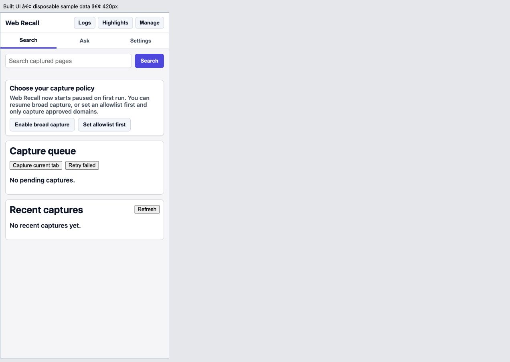

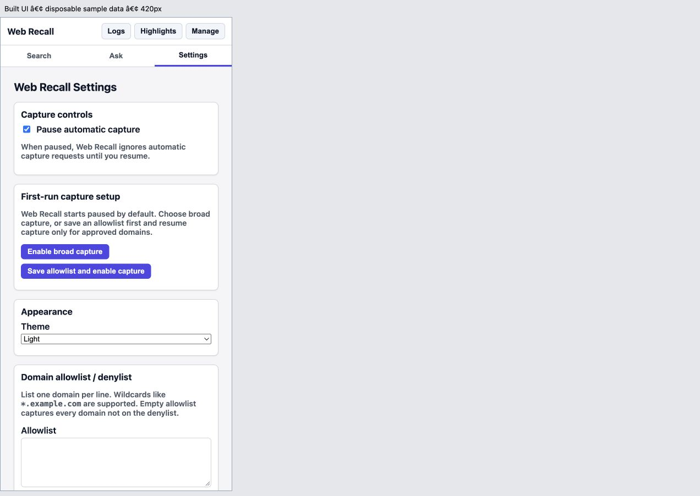

### 2. Settings and browser embedding setup — needs simplification

Embedding and chat providers are correctly separated. The browser option explicitly says a download is required. Selecting it reveals the download action, but both provider configurations remain visible and technical model identifiers dominate the explanation. Chat setup is far down the page, behind capture rules and embedding details. Prefer sections for Capture, Models, Appearance, and Advanced with feedback next to the changed control.

The current DOM contains duplicate `beta-enable-broad-capture` and `beta-ask-sources` IDs. The latter is shared by an Ask source container and a Settings number input; the Settings input appears unnamed in both the DOM snapshot and accessibility tree. Its label needs a unique target. “Max sources per answer” also lacks an explanation of how it relates to Ask's blank/auto override.

Browser-model download progress, cancellation, byte size, and failure recovery were not exercised in this preview.

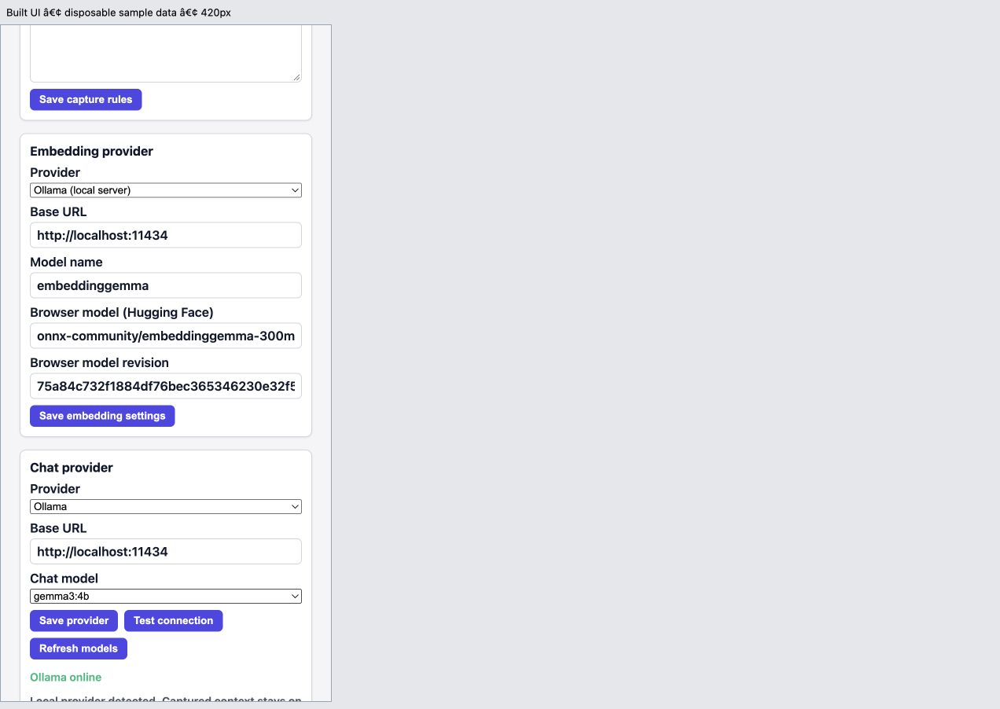

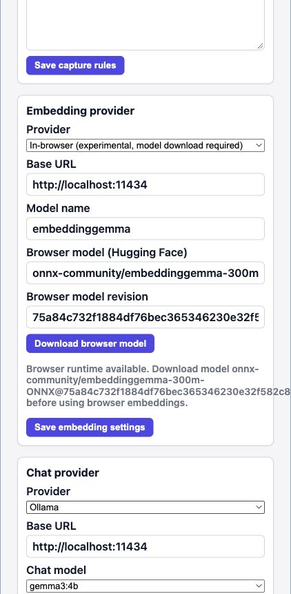

### 3. Search and narrow layout — results hierarchy needs attention

Submitting a query produces an understandable result count. The useful matches are nevertheless below an idle queue and recent captures. At 420px, only a few matches can be seen and metadata runs together. Show recents for the idle state and prioritize matches after submission.

At 360px, the initial Search view had no horizontal document overflow; dark and light links were distinguishable. ArrowRight on the selected Search tab left Search selected. DOM inspection showed no roving `tabindex` or `aria-controls` relationships on the tabs. Keyboard users can reach buttons with Tab, but the declared tab widget does not provide the expected arrow navigation.

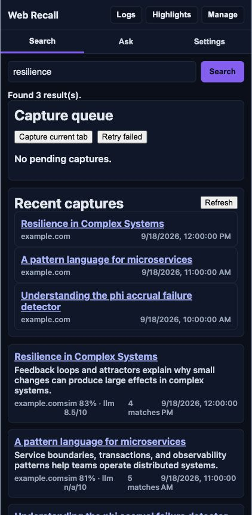

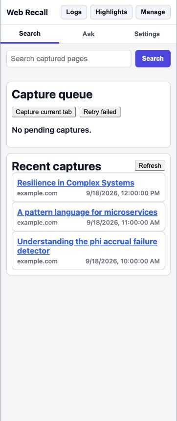

### 4. Ask pending and answer states — status is clearer; controls and reading need work

“Gathering sources…” is appropriate while waiting. Source cards stay associated with the sample answer. However, the same Ask button remains active during processing, with no Stop control. There is no explicit Clear action after completion. The sample Markdown answer is displayed literally, and every line is visually heavy. A concise activity summary with an expandable history would reduce the competition between process text and the answer.

The fixture produced deterministic streamed messages and one reference. It does not prove live retrieval relevance, citation accuracy, real token timing, or cancellation. The last fixture progress message should not be interpreted as evidence about the backend's final status events.

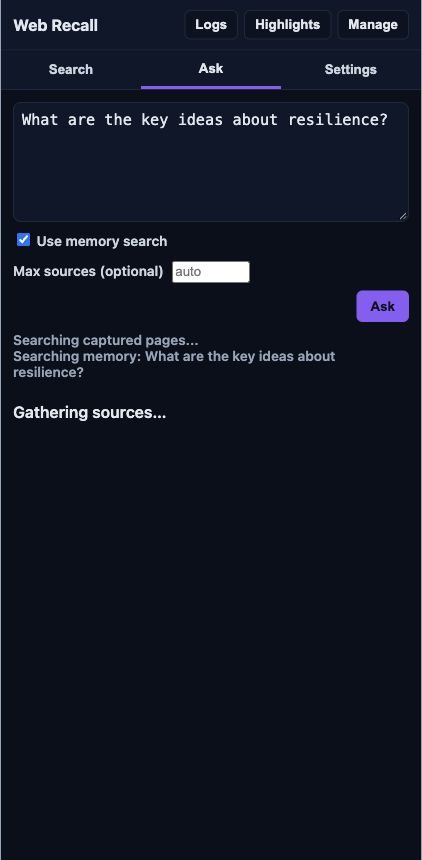

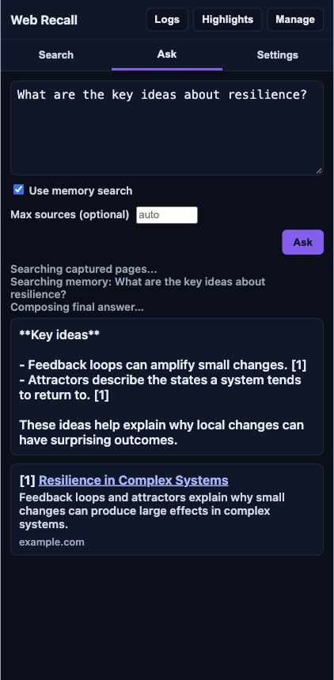

### 5. Memory maintenance — functional inventory, difficult to scan

Per-page embedding status, targeted Re-embed, import/export, and a missing-only default make the available actions understandable. But full URLs dominate the table, actions look visually unrelated to the styled toolbar, and status wraps into tall cells. Selected-row checkboxes have no accessible names. Use the title and domain as the main identity, put verbose details behind an expansion, and give maintenance actions their own clear progress states.

No real deletion, import, or backfill was performed. The correctness tests for those paths are documented separately in [review-remediation.md](review-remediation.md).

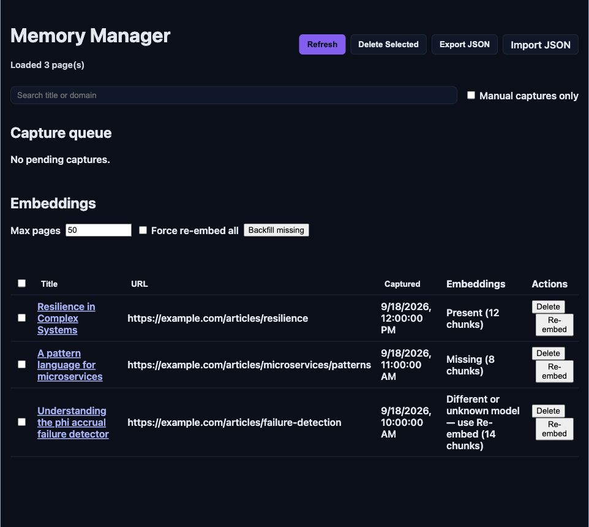

### 6. Daily Highlights — clear basic reading flow

The day, capture count, summary, and source links form an understandable grouping. Date-range controls are visible. Improvements are smaller: consistent Apply/disabled-button styling, an optional date preset, and shared navigation. This preview used a prepared summary, not a new model-generated highlight.

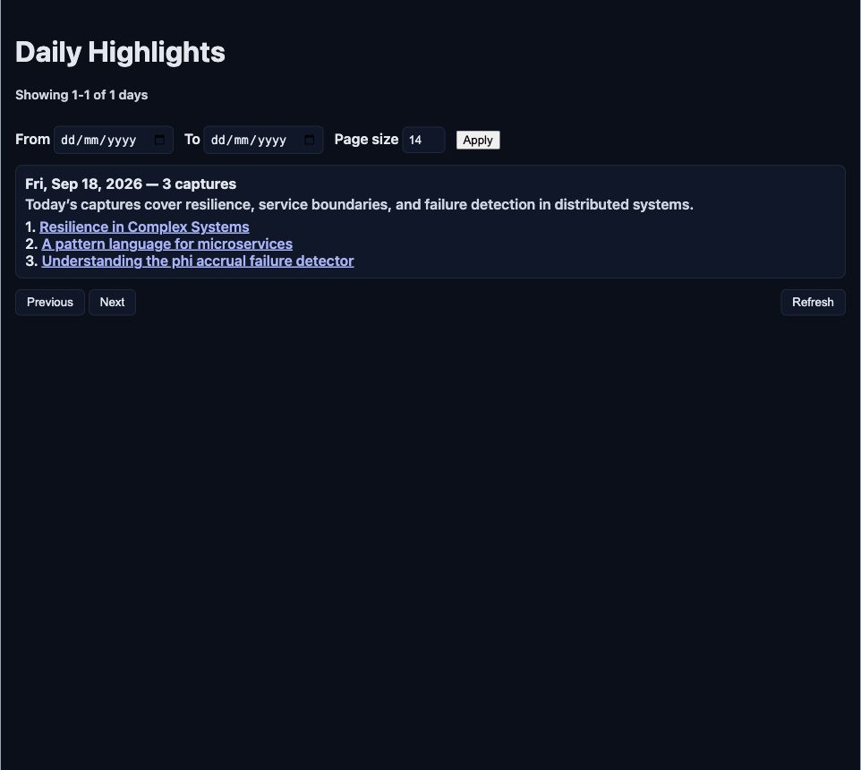

### 7. Logs — useful diagnostics, clarify filter semantics

Severity, timestamp, message, and structured data are easy to locate. Choosing Error filtered the sample to its single error entry. The screen still says “Loaded 2 entries,” so visible/total counts would help. “Level” currently means at least that severity, and “Debug” is not debug-only. Separate that browsing filter from the setting controlling which events are captured. Shared navigation and consistent controls would make this page feel part of the same product.

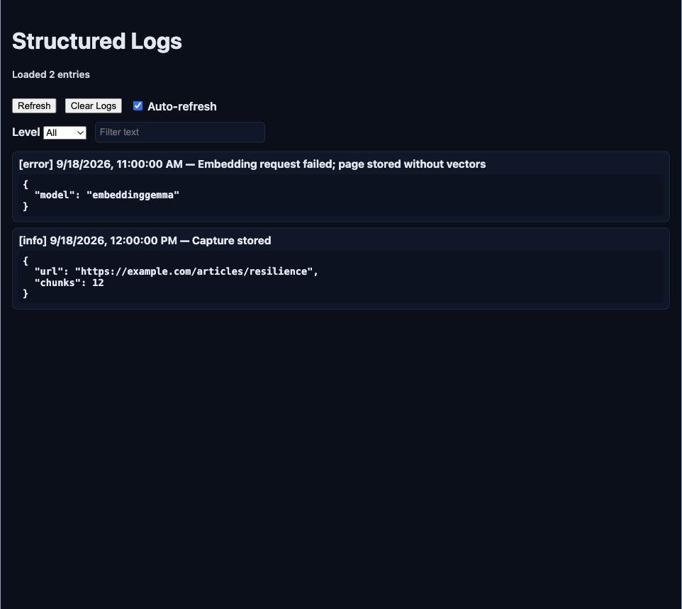

## Recommended implementation order

1. **Interaction correctness:** request state/Stop/Clear, final-response request guard, unique IDs and labels, keyboard tab behavior. Verify overlapping requests with a deliberately slow fixture.
2. **Reading and reflow:** move results above recents, wrap metadata, regular body text, common form/button styles, responsive Memory rows, safe Markdown and citation anchors.
3. **Setup and navigation:** selected-provider fields, short download/status copy with expandable details, grouped Settings, shared tool-page header, explicit log-filter semantics.

## Verification still needed

Run the rebuilt extension in Chrome with a disposable profile and real local providers: first model download/retry, capture while paused, worker restart, slow/failed Ask requests, and backfill progress. Then check 200% zoom, keyboard-only completion, a screen reader, long titles/errors, larger libraries, and actual contrast measurements. This review does not claim full accessibility compliance or live end-to-end acceptance.
